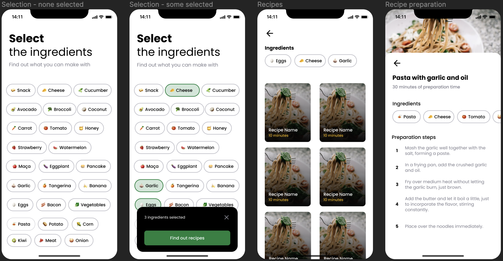

# What I Can Make - Chef 👨‍🍳

This is a mobile app that helps you to find out the possible recipes you can make using the ingredients you have at hand.

<div align="center">
  <kbd>
    
  </kbd>
</div>

## Description

Did you ever got stuck in remembering new or different recipes to make?
With WICM-Chef this is no longer a problem!

### Features

- Select the ingredients you have or want to use.
- Find out the recipes in the database that matches with the selected ingredients.
- See the preparation steps for the chosen recipe.

### Built with

- React-Native
- Expo
- Supabase (for the backend)

## Getting started

### Prerequisites

Dependencies not explicitly covered in the installation process; e.g., OS restrictions.

### Install

- `pnpm i`

### Configure

#### Supabase

You will need an Active [Supabase](https://supabase.com) project with:

**Tables:**

- `ingredients:`
  id | name | image
- `recipes:`
  id | name | image
- `recipes_ingredients:`
  id | recipe_id | ingredient_id
- `preparations:`
  id | recipe_id | step | description

**Storage:**

Set the enviroment variables. I'm using [direnv](https://direnv.net/).

```
EXPO_PUBLIC_SUPABASE_API_URL=<...>
EXPO_PUBLIC_SUPABASE_API_ANON_KEY=<...>
EXPO_PUBLIC_IMAGE_PATH=<...>
```

### Usage

- `npx expo start`

## Back matter

### To-do

- [x] Create a README.md file
- [ ] Add app screenshots to this README
- [ ] Add splash screen
- [ ] Add app icon
- [ ] Update the Figma (design) project
- [ ] Implement an admin area - CRUD for the recipes and ingredients
